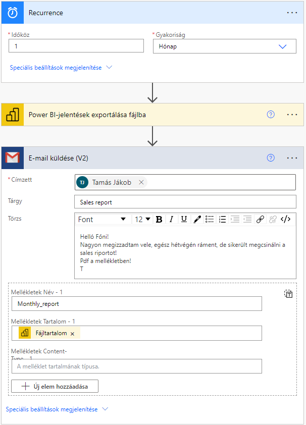

## Sales report example
Original source:
Tutorial of Lean Excel Solution youtube chanel ( [Sales Dashboard in Power BI | Power BI Dashboard](https://www.youtube.com/watch?v=CGgXHsD19Ek&t=656s) )

Benefits of this tutorial, and what I have learned from it:
- Handling of Date's
- Using slicers and filters (dropdown's, top N filter), interactions between filters and visuals
- Practice PowerQuery

This can be automated by PowerAutomate:

